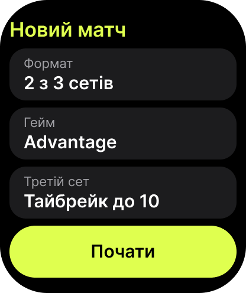
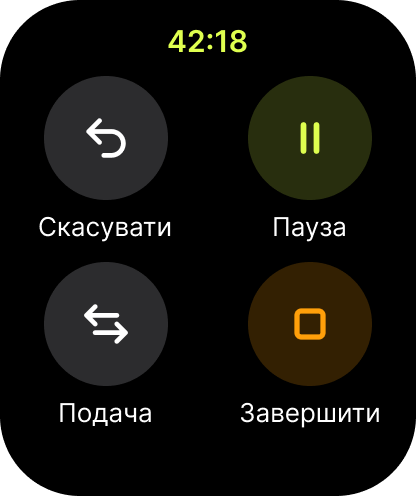
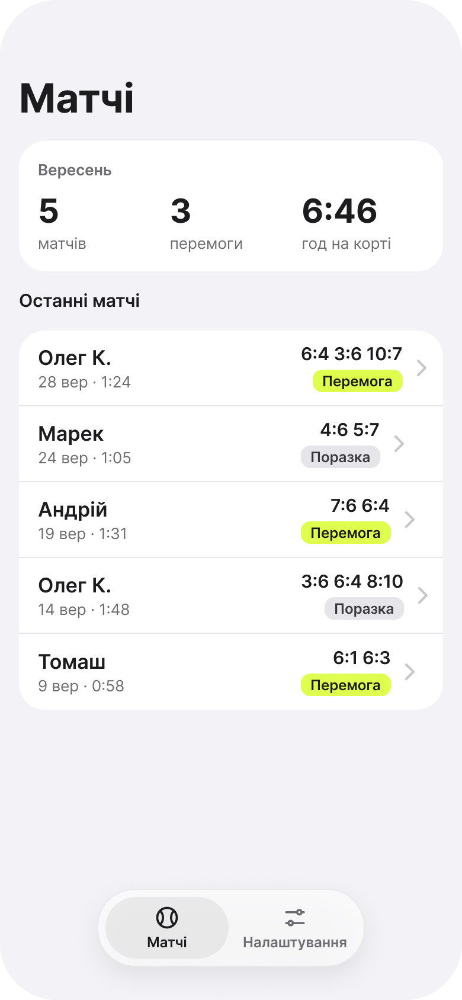
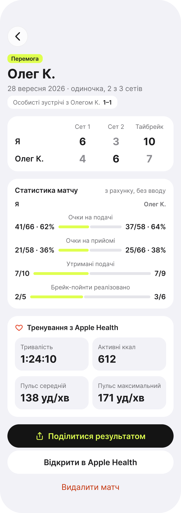

# Tennis Beat

A free, privacy-first tennis score keeper for Apple Watch and iPhone.

Planned for v1.0:

- **Scoring on the watch:** tap the top or bottom half of the screen to give the point to your opponent or to yourself. Undo is unlimited. Haptics mark games, sets and changes of ends. The match is saved as a tennis workout in Apple Health.
- **History and stats on the iPhone:** match history and head-to-head records. Stats come from the score alone, with nothing to type in: points won on serve and on return, service games held, break points converted and saved.
- **Free and private:**
  - No paywall, no accounts, no analytics, no third-party SDKs and no network calls.
  - Heart rate stays in Apple Health.
- **Languages:** English, Polish and Ukrainian from day one.

## Status
**Pre-MVP.** The harness and the project skeleton are in place. The scoring engine (`Packages/TennisCore`) is the next feature. Scope and roadmap: [`docs/product/plan.md`](docs/product/plan.md).

## Design
These are design mock-ups exported from Figma, not screenshots of the running app. Each screen has a written spec in [`docs/design/screens/`](docs/design/screens/).

| New match | Score | Controls | Summary |
| --- | --- | --- | --- |
|  |  |  |  |

| Match history | Match detail | Share card |
| --- | --- | --- |
|  |  |  |

## How it's built: an AI harness
Claude Code writes the code. A human (Denys) approves the specs, reviews and merges every PR, and tests on a real Apple Watch and iPhone. The harness is built around a few rules:

- **Spec first.** No code is written until the spec is `Status: Approved` ([GitHub Spec Kit](https://github.com/github/spec-kit)).
- **Rules with a source.** Scoring rules are paraphrased from the official ITF Rules of Tennis with stable IDs ([`docs/rules/itf-notes.md`](docs/rules/itf-notes.md)), and every engine test cites the rule it checks.
- **Test first.** Tests come before code, and every bug gets a regression test.
- **Independent review bound to a commit.** A separate reviewer agent checks only the spec, the diff and the tests, and reports the commit it reviewed. That evidence is only valid for that exact commit.
- **Honest metrics.** The project logs where each defect was caught: by tests, by the reviewer or on a device.

Details, gates and the metrics log: [`docs/harness.md`](docs/harness.md). Non-negotiable principles: [`.specify/memory/constitution.md`](.specify/memory/constitution.md). Agent instructions: [`CLAUDE.md`](CLAUDE.md).

## Development setup
**Requirements**
- macOS 26 or newer.
- Xcode 26.3 or newer. The project is kept in Xcode 26.3 format so that CI (Xcode 26.6) can open it.
- Apps target iOS 26 and watchOS 26.

**Tools**
```bash
brew install gh jq uv
uv tool install specify-cli --from git+https://github.com/github/spec-kit.git   # Spec Kit
brew tap getsentry/xcodebuildmcp && brew install xcodebuildmcp                  # XcodeBuildMCP
```

**Clone**
```bash
git clone https://github.com/dfinchenko/tennis-beat.git && cd tennis-beat
```

**Claude Code and MCP servers.** The servers are declared in [`.mcp.json`](.mcp.json); approve them when you first run `claude` in the repository.
- **Xcode** (`xcrun mcpbridge`): Xcode asks you to approve the agent the first time it opens the project.
- **XcodeBuildMCP**: telemetry is disabled through `XCODEBUILDMCP_SENTRY_DISABLED=true`.
- **Figma**: not used by agents. The Starter plan's MCP limit is exhausted, and [`docs/design/`](docs/design/) is the source of truth for design.

**Spec Kit** is already set up: `.specify/`, plus `/speckit-*` skills in `.claude/skills/`. Do not run `specify init` again.

**Xcode 27:** keep "strictly validate project" off and decline "Update to recommended settings". Either one writes `validationLevel` into `project.pbxproj`, which raises the project format to 110, and CI's Xcode 26 can't open that. The `check-project-format.sh` gate catches it.

## Build and test
```bash
# Scoring engine (pure Swift package)
swift test --package-path Packages/TennisCore

# Apps, simulator builds without signing (same commands CI runs)
xcodebuild build -project TennisBeat/TennisBeat.xcodeproj -scheme TennisBeat \
  -destination "generic/platform=iOS Simulator" CODE_SIGNING_ALLOWED=NO
xcodebuild build -project TennisBeat/TennisBeat.xcodeproj -scheme "TennisBeat Watch App" \
  -destination "generic/platform=watchOS Simulator" CODE_SIGNING_ALLOWED=NO

# Repository gates (also run in CI)
scripts/gates/check-infoplist-strings.sh   # Info.plist texts match InfoPlist.xcstrings (EN/PL/UK)
scripts/gates/check-project-format.sh      # project stays openable by Xcode 26
```

To run on a device, open `TennisBeat/TennisBeat.xcodeproj`, choose your team under Signing & Capabilities, and run the `TennisBeat Watch App` or `TennisBeat` scheme.

## Repository layout
| Path | Contents |
| --- | --- |
| `TennisBeat/` | Xcode project: iOS app, watchOS app and their test targets |
| `Packages/TennisCore/` | Event-sourced scoring engine and stats (pure Swift, no UI or HealthKit) |
| `docs/` | Product plan, ITF rules notes, glossary, design export, harness |
| `specs/` | Spec Kit feature specs, plans and tasks (created per feature) |
| `scripts/` | Claude Code hooks and CI gates |
| `.claude/` | Claude Code settings, the reviewer subagent and the Spec Kit skills |

## License
[MIT](LICENSE) © 2026 Denys Finchenko
