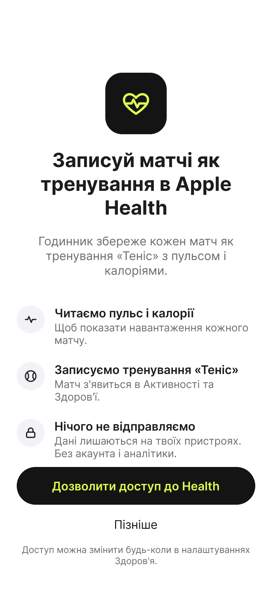

# iPhone 1 — Health permission

- **Figma:** node `11:70` "1 · Дозвіл Health", 390×844 pt (PNG @2x: 780×1688). The UK mock-up texts are copy drafts. EN (source) and PL go into the String Catalog later, following `docs/glossary.md`.
- **Tokens:** `../tokens.json`. **Type:** `../typography.md`.

## Layout
White background (`ios/surface`). Centred column with a 24 pt side inset:
1. An app-style icon: a rounded square (≈ 88 pt, `ios/ink`) with a heart-ECG glyph in `brand/ball`.
2. Title (iOS/Title 1, centred, `ios/text-primary`).
3. Subtitle (iOS/Body, centred, `ios/text-secondary`).
4. Three benefit rows, each with a round icon (≈ 40 pt, `ios/background-grouped`, `ios/ink` glyph). Each row has a heading (iOS/Headline) and a description (iOS/Subheadline, `ios/text-secondary`).
5. A primary button "Дозволити доступ до Health": capsule, `ios/ink` fill, `brand/ball` text, iOS/Headline.
6. A secondary text button "Пізніше" (iOS/Body).
7. A footnote (iOS/Footnote, `ios/text-tertiary`, centred).

## Texts (UK)
| Element | Text |
| --- | --- |
| Title | Записуй матчі як тренування в Apple Health |
| Subtitle | Годинник збереже кожен матч як тренування «Теніс» з пульсом і калоріями. |
| Row 1 | Читаємо пульс і калорії — Щоб показати навантаження кожного матчу. |
| Row 2 | Записуємо тренування «Теніс» — Матч з'явиться в Активності та Здоров'ї. |
| Row 3 | Нічого не відправляємо — Дані лишаються на твоїх пристроях. Без акаунта і аналітики. |
| Primary button | Дозволити доступ до Health |
| Secondary button | Пізніше |
| Footnote | Доступ можна змінити будь-коли в налаштуваннях Здоров'я. |

## Notes for the spec
- "Пізніше" must leave the app fully usable (constitution IX).
- The mock-up addresses the user with informal "ти". The Info.plist texts use formal "ви". The tone needs one decision.
