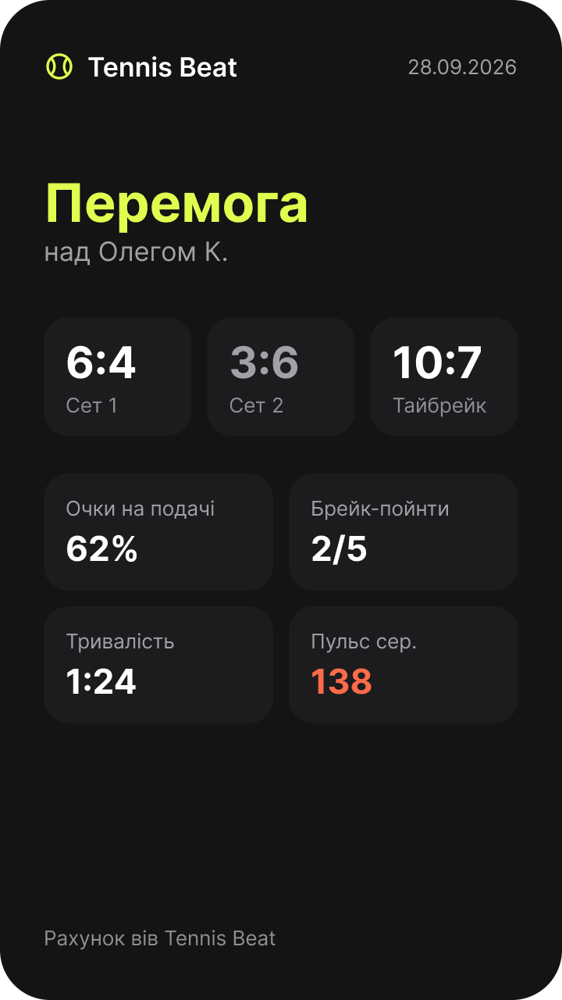

# iPhone 4 — Share card

- **Figma:** node `13:169` "4 · Картка для шерингу", 360×640 pt (PNG @2x: 720×1280). The UK mock-up texts are copy drafts. EN (source) and PL go into the String Catalog later, following `docs/glossary.md`.
- **Tokens:** `../tokens.json`. **Type:** `../typography.md`.

## Layout
A 9:16 card with a dark background (`ios/ink`) and a 28 pt inset, rendered with `ImageRenderer`:
1. Header: a tennis-ball glyph (`brand/ball`) with "Tennis Beat" (iOS/Headline, white) on the left, and the date "28.09.2026" (iOS/Subheadline, `watch/text-secondary`) on the right.
2. The result "Перемога" (≈ 56 pt bold, `brand/ball`) with "над Олегом К." below it (iOS/Body, secondary).
3. Three set tiles (`watch/surface`, radius ≈ 16). Each shows a score (iOS/Number L; a lost set is dimmed) and a label (Сет 1 · Сет 2 · Тайбрейк).
4. A 2×2 grid of stat tiles, each with a label and a value: Очки на подачі 62% · Брейк-пойнти 2/5 · Тривалість 1:24 · Пульс сер. 138 (`status/heart`).
5. A footer "Рахунок вів Tennis Beat" (iOS/Footnote, tertiary).

## Texts (UK)
| Element | Text |
| --- | --- |
| Result | Перемога / Поразка · над Олегом К. |
| Tiles | Сет 1 · Сет 2 · Тайбрейк · Очки на подачі · Брейк-пойнти · Тривалість · Пульс сер. |
| Footer | Рахунок вів Tennis Beat |

## Notes for the spec
- All numbers come from the engine or HealthKit (constitution VIII). The heart-rate tile is hidden without permission.
- "над Олегом К." uses the instrumental case and needs a grammar-safe string pattern.
