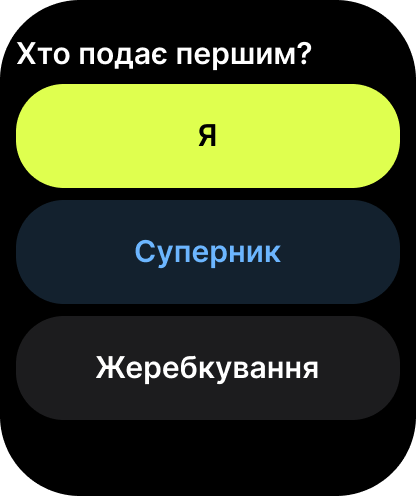

# Watch 2 — First server

- **Figma:** node `10:16` "2 · Перша подача", 208×248 pt (PNG @2x: 416×496). The UK mock-up texts are copy drafts. EN (source) and PL go into the String Catalog later, following `docs/glossary.md`.
- **Tokens:** `../tokens.json`. **Type:** `../typography.md`.

## Layout
Black background. Question title, then three full-width capsule buttons (≈ 52 pt tall, full width) stacked with 8 pt spacing:
1. "Я": `brand/ball` fill, `brand/on-ball` text.
2. "Суперник": `watch/button-opponent` fill, `brand/opponent` text.
3. "Жеребкування": `watch/surface` fill, `watch/text-primary` text.

## Components
- Capsule choice button (three styles: me / opponent / neutral).

## Texts (UK)
| Element | Text |
| --- | --- |
| Title | Хто подає першим? |
| Buttons | Я · Суперник · Жеребкування |

## Notes for the spec
- Glossary: Coin toss = Жеребкування, Opponent = Суперник. The rule reference is ITF SV-01.
- Buttons differ by label and position as well as colour, so colour is never the only cue.
