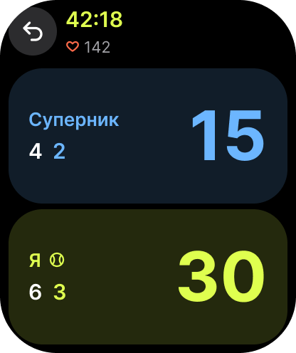

# Watch 3 — Score

- **Figma:** node `10:24` "3 · Рахунок", 208×248 pt (PNG @2x: 416×496). The UK mock-up texts are copy drafts. EN (source) and PL go into the String Catalog later, following `docs/glossary.md`.
- **Tokens:** `../tokens.json`. **Type:** `../typography.md`.

## Layout
Black background.
- **Header row:** an Undo button (circle ≈ 44 pt, `watch/surface-raised`, back-arrow glyph) at the top left. Next to it, elapsed time "42:18" (Watch/Title, `brand/ball`, monospaced digits) and below it heart rate "♡ 142" (Watch/Footnote, `status/heart` icon, `watch/text-secondary` number).
- **Two full-width tap zones** fill the rest of the screen, opponent on top and me at the bottom. Each is a rounded card, corner radius ≈ 24:
  - Opponent zone: `watch/zone-opponent` fill. Left side: label "Суперник" (Watch/Headline, `brand/opponent`); below it, sets and games "4  2" (Watch/Number; sets in `watch/text-primary`, games in `brand/opponent`). Right side: game points "15" (Watch/Score, `brand/opponent`).
  - My zone: `watch/zone-me` fill, same structure in `brand/ball`. The tennis-ball glyph next to "Я" marks the current server.
- Tapping a zone scores a point for that player.

## Components
- Player tap zone (label, server glyph, sets, games, point score).
- Round icon button (Undo).
- Timer and heart-rate header.

## Texts (UK)
| Element | Text |
| --- | --- |
| Zone labels | Суперник · Я |
| Example values | 42:18 · 142 · 4 2 / 6 3 · 15 / 30 |

## Notes for the spec
- The plan requires a deuce/ad side indicator (ITF SV-03, TB-04). It is not visible in the mock-up, so the spec must add it.
- The server is shown with a glyph, not only colour. VoiceOver must read the server and the full score.
- The heart-rate row is hidden when there is no Health permission.
