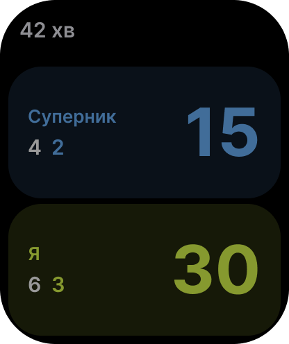

# Watch 5 — Always On

- **Figma:** node `10:90` "5 · Always On", 208×248 pt (PNG @2x: 416×496). The UK mock-up texts are copy drafts. EN (source) and PL go into the String Catalog later, following `docs/glossary.md`.
- **Tokens:** `../tokens.json`. **Type:** `../typography.md`.

## Layout
The same structure as **Watch 3 — Score**, dimmed for Always On:
- The header shows minutes only, "42 хв" (Watch/Title, `watch/text-secondary`). There are no seconds, no Undo button and no heart rate.
- The zone fills and score colours are darker, lower-opacity versions of `brand/opponent` and `brand/ball`. Sets and games are in grey.
- No server glyph is shown.

## Texts (UK)
| Element | Text |
| --- | --- |
| Header | 42 хв (minutes, via `FormatStyle`, with plural variations) |

## Notes for the spec
- HIG and the device checklist: no seconds or animations, and the score must stay readable.
- Leaving out the server glyph is a design choice for the spec to confirm.
