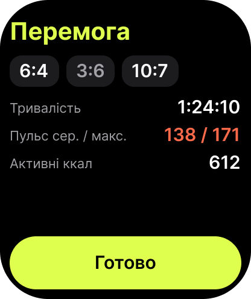

# Watch 6 — Summary

- **Figma:** node `10:117` "6 · Підсумок", 208×248 pt (PNG @2x: 416×496). The UK mock-up texts are copy drafts. EN (source) and PL go into the String Catalog later, following `docs/glossary.md`.
- **Tokens:** `../tokens.json`. **Type:** `../typography.md`.

## Layout
Black background.
1. The result title "Перемога" (Watch/Large Title, `brand/ball`).
2. A row of set-score chips ("6:4", "3:6", "10:7") on `watch/surface-raised`. Sets I lost use `watch/text-tertiary`; sets I won use `watch/text-primary`.
3. Key–value rows: label (Watch/Body, `watch/text-secondary`) on the left, value (Watch/Number style, right-aligned) on the right:
   - Тривалість: 1:24:10
   - Пульс сер. / макс.: 138 / 171 (`status/heart`)
   - Активні ккал: 612
4. A primary capsule button "Готово" (`brand/ball`).

## Texts (UK)
| Element | Text |
| --- | --- |
| Title | Перемога / Поразка |
| Rows | Тривалість · Пульс сер. / макс. · Активні ккал |
| Button | Готово |

## Notes for the spec
- The match tie-break is shown as a "10:7" chip (see ITF MT-05, a Not covered decision).
- The heart-rate and calories rows come from HealthKit and are hidden without permission. Active kcal is not in the plan's summary list (duration and average/max heart rate), so the spec must confirm it.
- Lost sets are dimmed, but the chip order also carries the meaning, and VoiceOver must read the full scores.
